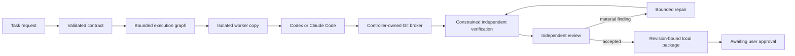

# AgentKit

**A portable, provider-neutral harness for bounded AI-assisted software delivery.**

[](https://www.python.org/)
[](#requirements)
[](#support-matrix)
[](#project-status)

AgentKit turns an engineering request into a validated task contract, a bounded execution graph, isolated implementation work, independent verification and review, and a revision-bound local approval package. It integrates with installed Codex and Claude Code CLIs while keeping task state, budgets, permissions and approvals under deterministic controller control.

The repository also includes ten audited engineering skills, seven domain procedures, strict handoff schemas, disposable fixtures and a regression suite. It uses only the Python standard library at runtime and works directly from a checkout.

> [!IMPORTANT]
> The validated live execution profile remains trusted, controller-created disposable workspaces on macOS. Read-only repository intake and an experimental Python-library delivery slice are now available, but general repository execution is not release-ready. Linux/Windows workers, GPU hosts and unattended untrusted code remain outside the validated boundary.

## Why AgentKit?

Most agent demos stop when a model says the task is complete. AgentKit treats model output as an untrusted proposal and requires controller-observed evidence before work can advance.

- **Provider-neutral execution.** Codex or Claude Code can implement or review through separate adapters and a shared result contract.
- **Durable control.** SQLite-backed state transitions, event history, budgets, checkpoints and evidence survive controller restarts.
- **Bounded workflows.** Call, timeout, concurrency, repair and graph limits are reserved and enforced by controller code.
- **Independent checks.** Verification runs against the candidate revision in a separate constrained copy with controller-owned acceptance tests.
- **Isolated assignments.** Up to two independent workers run concurrently in separate worktrees. Dependent assignments receive validated predecessor contributions before controller-owned integration.
- **Safe authentication recovery.** Missing or expired subscription login pauses the exact stage and resumes only after lifecycle, candidate and evidence revalidation.
- **Audited context.** Workers receive only role-relevant skill content, rehashed against the version recorded in the plan.
- **Approval separation.** A worker cannot approve publication. The workflow stops at a local package bound to the exact candidate revision.

## Project status

AgentKit is experimental. The original Phase 4 workflow has been extended with an OpenHarness reuse slice (R0), read-only repository intake (R1) and a deterministic repository-delivery slice (R2). R2 still has unresolved review findings; its presence is not a claim that arbitrary repositories are ready for execution.

| Area | Status |
|---|---|
| Audited skills and strict handoffs | Implemented and tested offline; validated documents grant no authority |
| Codex / Claude Code adapters and durable controller | Implemented; disposable coding and delivery have revision-specific live evidence |
| Authentication recovery | Fixture-tested, including repeated checkpoints and ownership reconciliation; interactive browser/device recovery is not live-validated |
| Request-driven scenario planning and concurrent scheduler | Fixture-tested; up to two isolated workers, dependency snapshots, atomic claims and quality-stage reserves |
| Corrected single-assignment live delivery | Passed at executable `342423e`; historical evidence, not blanket validation of later revisions |
| Concurrent live execution | Worker overlap observed at `b22020c`; that attempt blocked before integration |
| OpenHarness reuse (R0) | Offline-tested profile, context, protocol and terminal adaptations around the existing controller |
| Read-only repository intake (R1) | Fixture-tested bounded inspection, hash-bound enrollment and non-executing plans for clean standalone Python libraries |
| Repository delivery (R2) | Deterministic integration slice; corrective boundaries and durable stage-specific authentication resume are fixture-tested; live repository-provider validation remains open |
| Provider-planned static web products | Fixture-tested; no successful live game delivery or completed browser acceptance trial |
| GitHub publication, merge and deployment | Not implemented in the toolkit |

The archived `af80791` demonstration predates the corrected Phase 4 run. Later CLI integration evidence records successful Codex planning and Claude authentication failures; it does not establish current account status. Consult the [Phase 4 validation report](docs/phase4-validation-report.md) and [implementation checklist](docs/checklist.md) for the boundaries of each milestone.

## Requirements

- Python 3.9 or newer
- Git for workflows that create branches and worktrees
- Node.js 18+ for the optional reused terminal demo; web-product checks also require Node
- macOS for the currently validated execution sandbox
- Optional: subscription-authenticated Codex and/or Claude Code CLI for explicitly authorized live disposable runs

Runtime code has no third-party Python dependencies. The toolkit does not install CLIs, plugins or credentials and does not modify global CLI configuration.

## Quick start

Clone the repository and run the offline checks:

```sh
git clone https://github.com/adityachaturvedii/AgentKit.git
cd AgentKit

python3 -m agentkit check
python3 -m unittest discover -s tests -v
```

Explore the audited skill pack:

```sh
python3 -m agentkit list
python3 -m agentkit select diagnose
python3 -m agentkit show fault-diagnosis --domain backend-database
python3 -m agentkit validate contracts/examples/fault-diagnosis.json
```

`select` uses an explicit intent from `list`; it is not free-form model routing. `validate` checks structure and consistency only. It never executes commands or follows paths supplied by a handoff.

## Run a complete offline task

The default task workflow uses deterministic fake providers and a controller-created fixture, so it consumes no model quota:

```sh
python3 -m agentkit task fixtures

python3 -m agentkit task submit \
  --root /tmp/agentkit-task \
  --task-id calculator-demo \
  --project calculator \
  --request "Repair the calculator fixture"

python3 -m agentkit task plan \
  --root /tmp/agentkit-task \
  --task-id calculator-demo

python3 -m agentkit task start \
  --root /tmp/agentkit-task \
  --task-id calculator-demo

python3 -m agentkit task status \
  --root /tmp/agentkit-task \
  --task-id calculator-demo

python3 -m agentkit task package \
  --root /tmp/agentkit-task \
  --task-id calculator-demo
```

The workflow stops at `awaiting_pr_approval`. It does not push, open a pull request, merge or deploy.

Use a fresh `--root` for each demo. The built-in projects are intentionally narrow: `calculator` exercises a single assignment; text metrics and inventory provide independent work; the text pipeline exercises dependencies; case-policy conflicts require clarification. Deterministic planning uses request terms and bounded project inventory. Unmatched or contradictory requests do not silently become calculator repairs.

Inspect a two-assignment proposal without execution:

```sh
python3 -m agentkit task propose --project text-metrics \
  --request "Repair word and line metrics"
```

This scenario planner is not a general repository planner. The separate product path uses a provider-generated proposal subject to controller validation.

## How it works



The controller owns task state, transitions, budgets, Git mutations, evidence and approval records. Provider output can propose a change or finding, but cannot expand filesystem or network authority, alter budgets, mark evidence as passing or grant approval.

For decomposed tasks, each specialist writes to its own worker copy and assigned worktree. The controller validates allowed paths, commits accepted changes, integrates disjoint contributions and then verifies the combined candidate. Ready independent assignments may overlap, with a ceiling of two supervised provider workers. Dependent assignments start from deterministic snapshots of their declared predecessors, and integration applies only each worker’s own contribution. Conflicts block visibly. Chief-of-staff and manager responsibilities use deterministic controller logic; autonomous management reasoning is not implemented.

## OpenHarness reuse and repository intake

AgentKit adapts selected [OpenHarness](https://github.com/HKUDS/OpenHarness) code rather than replacing its existing delivery controller. The reused components cover public provider profiles, root-bounded context discovery, strict frontend events, private atomic writes and terminal presentation. Source pins, licenses and adaptations are recorded in the [R0 audit](docs/r0-dependency-license-audit.md) and [adaptation map](agentkit/integrations/openharness/adaptation-map.json).

Run the deterministic workflow through the reused components with a fresh output path:

```sh
python3 -m agentkit reuse-demo --output /tmp/agentkit-r0-demo
```

This requires Node 18+, installs no packages and makes no provider calls. The terminal is a one-shot dependency-free renderer; the full React/Ink TUI has not been adopted.

Read-only intake is available for an explicitly selected clean standalone Python-library repository:

```sh
python3 -m agentkit project profile-example
python3 -m agentkit project inspect /absolute/path/to/selected-project
python3 -m agentkit project --help
```

Inspection runs no project code, hooks, filters, installers or inference. Enrollment records a profile and content hashes; planning revalidates the repository and remains non-executing. Unsupported Git layouts, dirty baselines, symlinks and transforms fail closed. See the [R1 guide](docs/r1-project-intake.md).

R2 adds independent reconstruction into controller-owned Git storage, prepared-environment checks, protected acceptance and a local package using deterministic providers. It has no complete end-user execution CLI or verified live repository-provider path. The corrective work closes candidate revalidation, cross-provider enforcement, actual adapter construction, verifier placement and interpreter dependency detection offline. Authentication failures create safe checkpoints; a reopened workflow revalidates the candidate and resumes only implementation or review while preserving completed verification. File additions/deletions/renames, dependency installation and applying changes to the original checkout remain unsupported. See the [R2 report](docs/r2-validation-report.md).

## Live CLI integration

Start with the read-only diagnostic:

```sh
python3 -m agentkit doctor
python3 -m agentkit auth-status codex
python3 -m agentkit auth-status claude
```

`doctor` reports installed versions, advertised features, sanitized authentication observations and sandbox availability. It does not run inference or modify settings. Unknown billing, model, usage or capability information remains unknown.

A live disposable task requires both `--live` and explicit subscription-smoke authorization:

```sh
python3 -m agentkit task start \
  --root /tmp/agentkit-task \
  --task-id calculator-demo \
  --live \
  --authorize-subscription-smoke
```

Live execution uses the installed CLI's existing subscription authentication. AgentKit does not introduce API keys, enable paid fallback, purchase credits or change authentication methods. If authentication is missing or expired, the task pauses at `authentication_required`. The official interactive login flow runs in an attached terminal and keeps passwords, MFA, tokens, codes and raw login output out of controller evidence and model context. See [guided authentication recovery](docs/authentication-recovery.md).

Declare call, time and concurrency budgets when submitting a live task; inspect `task submit --help` and the [CLI guide](docs/phase4-cli-guide.md) before running it. Do not include live commands in ordinary CI.

### Routing and resource policy

Routing profiles record provider, exact or account-default model, eligible roles, availability evidence and a selection reason. Requested model and supported effort settings remain separate from provider-reported metadata. Missing comparative evidence means the configured default is **not** claimed to be cost-optimal. See the [routing example](docs/examples/phase4-routing.json).

Provider controls resolve in this order: explicit task override → configured role policy → provider default. Productive output, turn and retry settings are unset unless an override uses a verified CLI control; the historical 512-token setting belongs only to the tiny smoke profile. Provider defaults are not unlimited.

The controller reserves calls and allocated execution time, enforces process deadlines and captured-output bounds, and retains capacity for verification and review. A CLI launch may contain multiple internal requests: launch counts are not token or monetary caps. Missing usage, internal request counts and billed cost stay unknown; estimates remain separate.

```sh
python3 -m agentkit resource-policy
```

See [resource policy and role capabilities](docs/cli-resource-policy.md) for enforced, best-effort and observable-only controls.

### Static web product work

The `product` commands accept a brief for a fresh dependency-free static web project. A provider proposes assignments; the controller validates scope, dependencies, acceptance and budget before execution. Protected mechanics checks and exact-revision browser evidence are required for acceptance. Browser interaction is externally driven, not a general built-in browser agent.

The first Breakout attempt failed during planning; the later integration checkpoint stopped on Claude authentication failures. No playable game or completed product acceptance is claimed. See the [product workflow](docs/product-workflow.md) for commands, prerequisites and retained evidence.

## CLI overview

| Command | Purpose | Inference |
|---|---|---|
| `python3 -m agentkit list`, `select`, `show` | Discover and render audited skills and domain procedures | No |
| `python3 -m agentkit validate` | Validate an untrusted structured handoff | No |
| `python3 -m agentkit check` | Check sources, references, notices and blocked examples | No |
| `python3 -m agentkit doctor` | Inspect local CLI and sandbox capabilities read-only | No |
| `python3 -m agentkit boundary-check` | Run disposable filesystem boundary canaries | No |
| `python3 -m agentkit lifecycle-check` | Exercise timeout, cancellation and child cleanup fixtures | No |
| `python3 -m agentkit smoke` | Run a bounded model-only provider check | Explicit authorization required |
| `python3 -m agentkit execution-check` | Run a bounded disposable coding check | Explicit authorization required |
| `python3 -m agentkit controller-demo` | Exercise the Phase 3 delivery controller | Fake by default; live is opt-in |
| `python3 -m agentkit auth-status`, `auth-login`, `auth-reconcile` | Inspect or recover official subscription login | Login is interactive and uncaptured |
| `python3 -m agentkit task ...` | Propose, submit, run, inspect, cancel, resume and package disposable tasks | Fake by default; live is opt-in |
| `python3 -m agentkit resource-policy` | Explain resolved controls and capability profiles | No |
| `python3 -m agentkit reuse-demo` | Exercise adapted OpenHarness components with the existing controller | No |
| `python3 -m agentkit project ...` | Inspect, enroll and plan a selected supported repository read-only | No |
| `python3 -m agentkit product ...` | Plan and execute a bounded disposable static web product | Provider stages require explicit authorization |

Run `python3 -m agentkit --help` or a subcommand's `--help` for the exact options.

## Trust and safety model

AgentKit is built around explicit boundaries:

1. **The controller is authoritative.** Model responses cannot change permissions, budgets, evidence state or approval state.
2. **Git worktrees are not sandboxes.** Workers receive tracked-file copies without controller state or shared Git metadata. The controller alone applies validated changes.
3. **Verification is separate.** Acceptance tests run in a fresh candidate copy under the tested read-only/no-network macOS profile.
4. **Uncertainty blocks replacement.** After a controller interruption, executions with uncertain process ownership must be reconciled before relaunch.
5. **Usage stays honest.** Missing token and cost data remains `unknown`; an estimated cost is never presented as billed cost.
6. **Publication is a separate authority.** A local approval package is evidence for a decision, not the decision itself.

Read the [threat model](docs/threat-model.md), [controller contracts](docs/controller-contracts.md), [runtime contracts](docs/runtime-contracts.md) and [sandbox matrix](docs/sandbox-matrix.md) before extending an execution profile.

## Support matrix

| Capability | macOS | Linux / WSL2 / Windows | Notes |
|---|---:|---:|---|
| Offline skill discovery and validation | Tested | Unverified | Python standard library only |
| Deterministic fixture workflow | Tested | Unverified | No provider calls |
| Read-only CLI diagnosis | Tested | Unverified | Can report unavailable inside a parent sandbox |
| Trusted disposable owned-code execution | Tested | Unsupported | Requires the validated macOS guard |
| Independent constrained verification | Tested | Unsupported | Fails closed if Seatbelt cannot initialize |
| Selected Python-library repository intake | Fixture-tested | Unverified | Read-only; no broad compatibility claim |
| General repository execution | Unsupported | Unsupported | R2 remains an experimental deterministic slice with open review findings |
| Detached-process containment | Unsupported | Unsupported | Local process-group cleanup is narrower |
| Comprehensive credential isolation | Unsupported | Unsupported | No claim over every host credential path |
| Remote or GPU workers | Unsupported | Unsupported | Planned for a later phase |

The sandbox does not prove isolation for every provider tool, network route or credential service. Unsupported isolation fails visibly; managed runs do not silently retry without the guard.

## Repository layout

```text
agentkit/     controller, adapters, sandbox, CLI and OpenHarness adaptations
frontend/     dependency-free terminal renderer
third_party/ retained OpenHarness license
skills/       curated engineering procedures
domains/      backend, frontend, ML, training, CUDA and inference guidance
contracts/    versioned handoff schemas and examples
audit/        pinned upstream source inventory
notices/      retained upstream license texts
tests/        deterministic and disposable integration fixtures
evidence/     hash-bound historical validation artifacts
docs/         contracts, decisions, threat model and phase reports
```

Skills reference shared contracts and notices, so copy or archive the complete repository rather than a single `SKILL.md`. Relocation is tested; package installation, auto-discovery and rollback remain future work.

## Validation

The branch reconciliation ran 215 tests: **212 passed and 3 skipped** in the managed tool environment (two Seatbelt checks and one loopback preview). Structural checks passed for ten skills, seven domain procedures, ten examples and three pinned foundation sources. This is regression evidence, not proof that the open R2 findings are resolved. Host-only results in earlier reports apply to their tested paths and revisions.

```sh
python3 -m unittest discover -s tests -v
python3 -m agentkit check
```

Validation evidence is intentionally separated:

- [Foundation validation](docs/validation-report.md)
- [Phase 2 CLI and sandbox validation](docs/phase2-validation-report.md)
- [Phase 2 execution follow-up](docs/phase2-execution-followup.md)
- [Phase 3 controller validation](docs/phase3-validation-report.md)
- [Phase 3 review findings](docs/phase3-review-findings.md)
- [Phase 4 validation](docs/phase4-validation-report.md)
- [R0 reuse validation](docs/r0-validation-report.md)
- [R1 intake validation](docs/r1-validation-report.md)
- [R2 delivery validation](docs/r2-validation-report.md)

Historical evidence is hash-bound to the revision it tested. A successful archived run is not silently promoted to evidence for later code.

## Roadmap

The [reuse-first engineering plan](docs/planning/README.md) prioritizes existing-repository engineering for small teams, followed by new-product creation.

- **Implemented:** audited skills, adapters, disposable delivery, authentication checkpoints, concurrent scenario workflows, resource policies, R0 component reuse and R1 read-only intake.
- **Corrective gate:** resolve R2 review findings and validate the real adapter, authentication and verifier paths before extending repository execution.
- **Next planned milestones:** R3 portable package, terminal workflow and distribution; R4 measured pilot evaluation; R5 new-product acceptance through shared delivery contracts.
- **Deferred:** optional Linux/GPU workers, broader isolation, GitHub publication and deployment.

The [implementation checklist](docs/checklist.md), [decision log](docs/decisions.md) and [original specification](docs/implementation-spec.md) distinguish implemented, simulated, live-tested and planned behavior.

## Contributing

Contributions should preserve the toolkit's evidence and authority boundaries.

1. Create a dedicated branch and worktree from the verified `implementation/phase-2` tip. Target feature PRs there; promote integration through a separate release PR into `main`. Push, PR and merge authorization remain separate.
2. Keep runtime dependencies at zero unless a reviewed requirement justifies one.
3. Use disposable fixtures; never point tests at personal repositories or real secrets.
4. Keep live provider calls out of the default suite.
5. Add behavioral tests for controller, adapter or boundary changes.
6. Update `docs/checklist.md` and `docs/decisions.md` when behavior or scope changes.
7. Run the full test suite and offline pack check before proposing a change.

Please open an issue before proposing a new execution platform, authentication method, paid provider path or authority-expanding integration. Do not include credentials, authorization codes or raw authentication transcripts in issues, commits or test fixtures.

## Attribution and license status

Adapted procedures and selected OpenHarness components preserve source attribution and applicable MIT notices. See the [source audit](docs/source-audit.md), [pinned source lock](audit/sources.lock.json), [third-party notices](THIRD_PARTY_NOTICES.md) and [OpenHarness reuse audit](docs/r0-dependency-license-audit.md).

The original AgentKit code does not yet have an outbound `LICENSE` file. Until the maintainer selects and adds one, the repository is available for review but is **not formally offered under an open-source license**. Third-party notice files cover only their respective upstream material.
