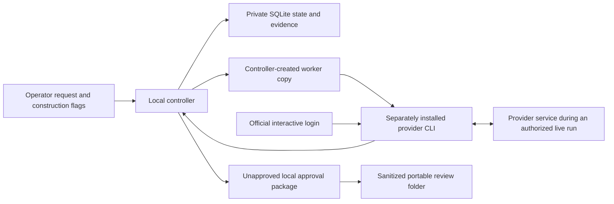

# R3 data flow and retention

AgentKit separates local controller authority, provider execution, official login, and portable review export. The source-checkout installation and ordinary regression suite are offline and make no inference calls.

## Data by boundary

| Boundary | Data crossing it | Authority and retention |
|---|---|---|
| Operator to controller | Task ID, objective, selected fixture/project, bounded resource configuration, and trusted CLI construction flags | Stored locally as task/contract/plan state. Model text and frontend events cannot grant live execution, approval or publication authority. |
| Controller to worker/provider CLI | Role-specific prompt, bounded verified skill context, allowed paths, candidate or assignment identity, and a controller-created working copy | The provider CLI can process these inputs and tool results. The controller does not send its database, approval directory or authority token to the worker. |
| Provider CLI to provider service | Provider-defined request traffic needed for an explicitly authorized live subscription run | Host network access is required and no provider-domain allowlist is claimed. Vendor-side processing/retention is governed by the provider account and service, outside AgentKit's local evidence controls. |
| Provider CLI to controller | Redacted JSONL/text, terminal status, optional usage, changed files or structured review output | Stored in private local execution/evidence paths. Missing tokens, internal requests, retries and billed cost remain unknown. Provider success cannot approve its own work. |
| Controller to portable export | Sanitized approval summary, full candidate diff, requirement matrix, required evidence, review guide and hashes | Export excludes the controller database and execution authority. Local SHA-256 integrity is unauthenticated and grants no approval, import, application, publication or execution authority. |

## Authentication is a separate flow

AgentKit uses official provider status/login commands for separately installed Codex or Claude Code. It does not read credential contents, copy browser cookies, add API keys, purchase credits or switch authentication methods. Interactive login uses an attached terminal; passwords, MFA values, device codes, authorization codes and raw login transcripts are not captured, hashed, persisted or sent to a model.

The provider CLI manages its own user-home or Keychain-backed credentials. The login process is trusted host-side code and is not claimed to be comprehensively isolated from other user files. A successful status check is an observation, not proof that a token will remain valid for the next inference call. Missing or expired authentication pauses the exact workflow stage; resume requires explicit live construction flags and candidate/checkpoint revalidation.

## Local retained data

A workflow root can retain:

- controller SQLite state, events, budgets, authentication checkpoint metadata and execution ownership records;
- controller-owned repositories, worktrees and worker/candidate copies;
- redacted provider streams, result records, prompt hashes, verification/review evidence and manifests;
- a revision-bound local approval package whose approval remains false;
- terminal/protocol output when the operator redirects or saves it.

Files are created with private modes where implemented, but Git does not preserve privacy modes on checkout. Redaction is bounded and is not a universal secret detector. Real secrets must not be placed in tasks or fixtures. Uninstalling the source checkout does not delete workflow roots, exported packages, provider CLI state or provider-side data.

## Offline and unsupported flows

`agentkit check`, deterministic tests, fixture workflows, status views, package export and package verification require no model inference. Package verification reads files and hashes only; it does not execute candidate code.

AgentKit does not implement publication, pull-request creation, merge, deployment, remote cancellation, signed provenance, authenticated team approval, portable-package import/application, provider billing control, comprehensive credential isolation, or a general network sandbox. General repositories and untrusted code are outside the supported execution boundary.

See the [offline distribution procedure](r3-distribution.md), [portable-package guide](r3-portable-package.md), and [authentication recovery boundary](authentication-recovery.md) for the corresponding operator workflows.
